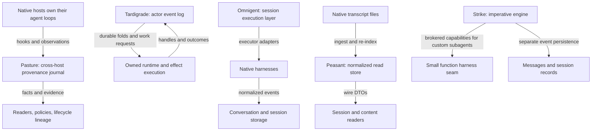
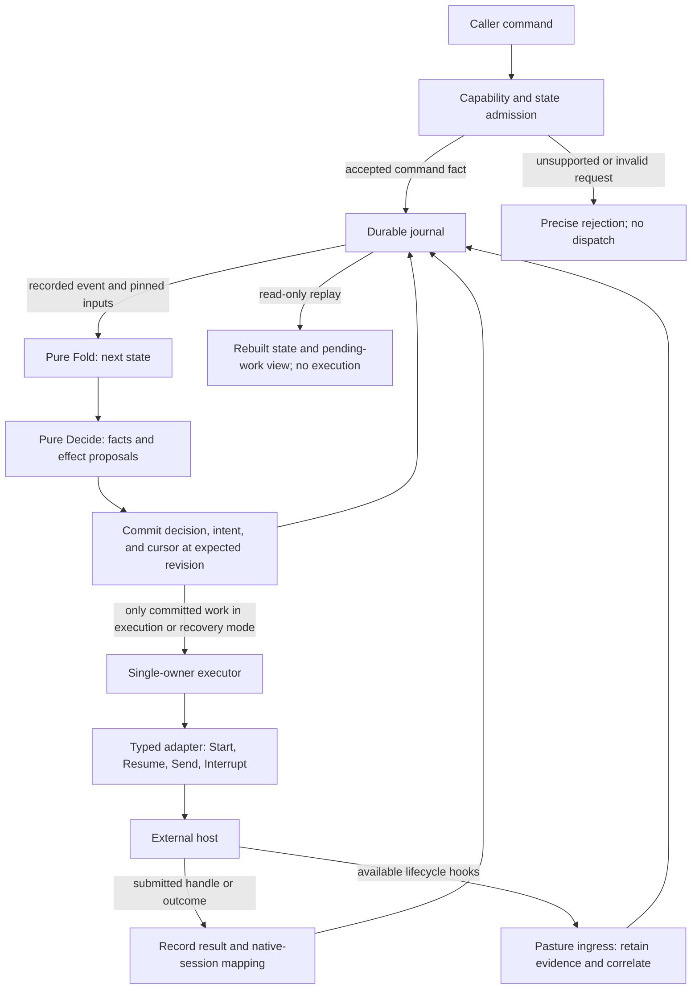
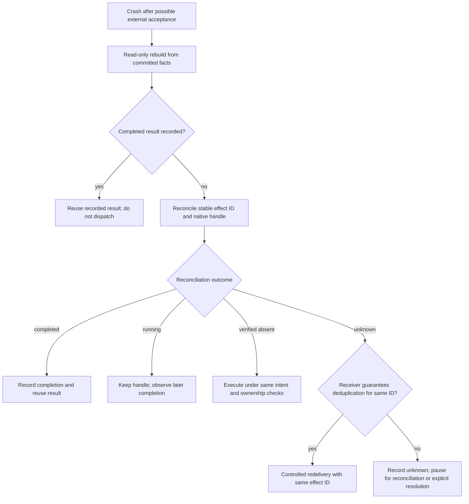
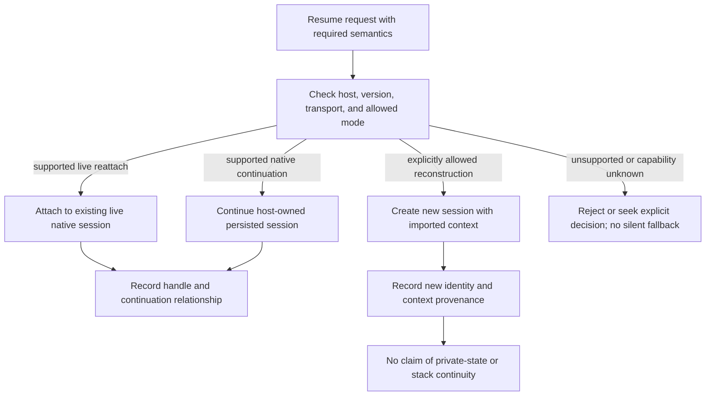
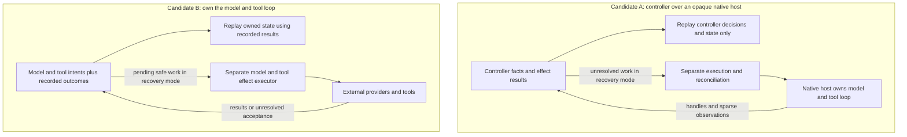

# Functional cross-harness execution on the Pasture journal

> **Status:** Completed source-research report, including the original four repository inventories, synthesis, and independent supplemental Tardigrade/Strike functional-runtime evidence. This is not a ratified specification or implementation plan. Remaining integration and live-runtime unknowns are identified in §8.

## Contents

- [How to read this report](#reading-guide)
- [Glossary](#glossary)
- [1. Executive assessment](#executive-assessment)
- [2. Request, scope, and evidence method](#request-and-evidence)
  - [Recorded conversation Q&As and directives](#conversation-record)
- [3. What each system's log represents](#log-ownership)
- [4. Comparison on the requested axes](#comparison)
- [5. Durability, query, causality, and verification details](#durability-details)
- [6. Clarified functional-runtime direction](#proposed-runtime)
- [7. Minimality, adoption choices, and verification requirements](#adoption-and-validation)
- [8. Supplemental synthesis and limitations](#limitations)
- [9. Two unanswered architecture decisions](#unanswered-decisions)
- [10. Conclusion](#conclusion)

<a id="reading-guide"></a>
## How to read this report

**how-to**

The organization follows the reading-guide, glossary, diagrams, contextual **Why**, and questions-and-answers pattern of `isaaclab-onboarding.md` at `/home/minttea/dev/sfurs-software-nixified/sw-rl-agent/`. Only the presentation pattern is adapted; no IsaacLab technical content or audited language-compliance claim is imported.

Section labels indicate purpose:

- **concept** — explains an idea or a proposed boundary.
- **state** — records current evidence, observed implementation, or actual conversation.
- **problem** — identifies an uncertainty or an unanswered decision.
- **how-to** — gives a reading or validation procedure, not permission to implement.

For a first read, use the glossary, §1, the ownership diagram in §3, and the proposed functional boundary in §6.1. For source verification, read the revision ledger in §2.3 and the inventories in §3–5. For planning, read the crash/reconciliation diagram in §6.3, replay boundaries in §6.5, and the **unanswered** decisions in §9.

The five Mermaid diagrams are explanatory views, not executable contracts. Each has a caption distinguishing observed systems from proposed architecture. Arrows mean labeled data/control flow, not necessarily a function argument, transaction, or guarantee. Mermaid-capable viewers render the diagrams; other viewers show their source. Read the accompanying prose for the constraints.

<a id="glossary"></a>
## Glossary

**concept**

| Term | Meaning in this report |
|---|---|
| Native host / harness | An agent runtime such as Claude Code, Codex, or OpenCode. Its private loop is not owned by Pasture's lifecycle journal. |
| Functional harness | The user's requested execution layer: composable functions over events, with separate session-control effects. Not merely a conformance test runner. |
| Controller | The proposed layer that owns command admission, decisions, effect intents, and native-session mappings. |
| Owned loop | A runtime that directly controls model/tool calls, rather than only driving an opaque host. |
| Command | A requested action that can be refused. Acceptance does not mean the external action completed. |
| Event / fact | A recorded admission, observation, decision, or outcome. An observation can contain incomplete or malformed evidence. |
| Fold | A pure computation of state from prior state and a recorded event. |
| Decide | A pure computation proposing decisions/work from folded state. It does not perform the work. |
| Effect intent | A committed description of external work, with a stable identity. Not proof that the work ran. |
| Effect result / submitted handle | A recorded outcome, or a durable reference to work that may complete later. A PID alone is not a durable session identity. |
| Adapter | The narrow implementation of native Start/Resume/Send/Interrupt and observation/reconciliation capabilities. |
| Occurrence / payload digest | An occurrence identifies a retained delivery; its payload digest identifies the body. Equal bodies need not mean equal occurrences. |
| Binding / lineage link | A native identity attached to evidence, or a predecessor edge within one host. Neither is a cross-host runtime-session mapping. |
| Journal idempotence | Exact retries of a canonical database operation reuse its committed result. This does not guarantee exactly-once external effects. |
| Controller replay | Read-only reconstruction from recorded facts/results with pinned interpretation. It does not execute effects. |
| Recovery | Separate reconciliation and controlled dispatch of unresolved work after reconstruction. |
| Reconciliation | Inspection of native state/operation identity to determine running, completed, absent, or unknown without blindly repeating the action. |
| Native continuation / live reattach | Continue the host's persisted session, or attach to an already live session. These are different capabilities. |
| Context reconstruction | Start a new session with imported recorded context. It does not restore hidden state or arbitrary function stacks. |

<a id="executive-assessment"></a>
## 1. Executive assessment

**concept**

**Yes, an event-driven, functional-programming-inspired cross-harness execution layer can be built on Pasture's journal. Pasture v0.0.11 does not already provide that execution layer.** The useful design is a small controller whose state is reconstructed from durable facts, whose pluggable functions compute decisions and effect intents, and whose adapters perform session start, resume, prompt submission, interruption, and reconciliation. The journal supplies evidence, ordering, identities, and operation retry semantics; it does not turn a lifecycle observation into a process-control API.

The strongest combination of the inspected systems is:

- **Pasture:** version-pinned cross-host lifecycle contracts, raw evidence retention, binding/lineage records, policy/provenance facts, and a durable operation boundary.
- **Tardigrade:** the immutable event log as runtime state, folds over the log, named effect coordinates, explicit recovery, and tests that compare reopened state with the original state.
- **Omnigent:** a narrow executor seam, declared capabilities, centralized event normalization, and realistic adapter drift checks.
- **Peasant/schema:** optional neutral content/read contracts, explicit ingestion dispositions, and versioned export metadata—not an execution controller.
- **Strike:** a small function/capability API for custom subagent harnesses, illustrating maintainable composition without a discovery framework; its current engine is imperative, not a Tardigrade-equivalent durable effect runtime.

The critical distinction is **controller replay versus host replay**. A controller can reconstruct “a session start was requested, the adapter reported native session X, a turn was submitted, and an interrupt is unresolved.” It cannot reconstruct Claude Code's, Codex's, or OpenCode's private agent state from Pasture hook records. Nor does a recorded effect result guarantee an external action happened exactly once. If a host accepted a prompt and the controller crashed before recording success, the next safe operation is reconciliation, not blind resubmission.

**Recommended research direction:** adapt Tardigrade's functional-core/effect-shell principles around Pasture facts, borrow Omnigent's executor/capability seam, and keep Peasant exports downstream. Do not copy a whole framework, build a generic plugin marketplace, or substitute a conformance runner for the requested runtime. Verification remains a supporting use case.

<a id="request-and-evidence"></a>
## 2. Request, scope, and evidence method

**state**

### 2.1 Original request and clarification

Original request, recorded in `aura-plugins-7o7ve0`:

> Clone this https://github.com/clavia-labs/tardigrade to @~/codebases/clavia-labs/tardigrade (doesn't exist yet) and compare the state of v0.0.11's journal against the audit log of tardigrade. can we also form a cross-harness functional harness ontop of the journal? similar to Databricks' Omnigent. may also leverage the @~/dev/peasant-labs/peasant/develop and schema.

The controlling clarification is:

> by "functional harness" I mean a functional programming inspired approach to harness development, similar to tardigrade or strike at @~/codebases/strike . We'd want an execution layer that also starts, resumes, and controls sessions, but using the tardigrade approach to pluggable functions ontop of events.

This supersedes the first synthesis's conformance-runner-only recommendation. A test harness that drives scenarios and asserts journal evidence is useful, but **not sufficient**: the desired product owns ongoing execution and recovery, with functions operating over events.

### 2.2 Method and confidence

This report synthesizes the full evidence inventories in `aura-plugins-7h39tp`, `aura-plugins-x107k6`, `aura-plugins-htz0jw`, and `aura-plugins-ve7ni7`, the interpretation correction in `aura-plugins-hgntoj`, and the completed supplemental inventory in `aura-plugins-axymsl`. These were source-reading investigations, not live execution trials. Selected Pasture contracts, Tardigrade act declarations, Strike's function API/interrupt semantics, and Omnigent's capability definitions were directly re-read while drafting. Citations below identify the exact inspected repository or module version and source location; findings inherited from the original investigators retain their source references.

“Not found” means not identified in the inspected source inventory, not proof that no deployment or future revision can supply it. Runtime guarantees are separated from test coverage and product documentation. No live sessions, credentialed model calls, hook installation, benchmarks, or implementation were performed for this deliverable. No industry-wide standard or independent maturity/adoption survey is claimed: the prior-art set is the set requested by the user.

### 2.3 Revision ledger

All repository-relative citations use these pins, **not whichever branch is current later**:

| Label | Source and inspected revision | Location / significance |
|---|---|---|
| **P** | `dayvidpham/pasture`, v0.0.11 → `aba341ceb6bb8f1a2be5928e8735568c4f5cb563` | Read-only archive at `/tmp/opencode/pasture-v0.0.11-extract`; annotated tag object `ddb8fb3bc8d2941c4967d0a2759e4fe07cdd9e0f`, tagger 2026-10-08 12:22:39Z; release PR #167. |
| **PV** | `github.com/dayvidpham/provenance` v0.3.0 | Dependency pinned by **P** `go.mod:6`; module source is version-pinned separately from Pasture. |
| **T** | `clavia-labs/tardigrade` `05120bc7b24380dc013c7b04ab198f5497f9742a` | `/home/minttea/codebases/clavia-labs/tardigrade`; 2026-10-08, “fix(core): capture durable atoms once (#711)”. |
| **O** | `omnigent-ai/omnigent` `8a65a726275ed6db90f5115d682b452343f5c017` | `/home/minttea/codebases/omnigent`; 2026-07-30, subprocess secret-inheritance fix (#3479). |
| **E** | `peasant-labs/peasant` `d6db28cf2f1de390943394e5715b3f7c3bf4cd00` | `/home/minttea/dev/peasant-labs/peasant/develop`; 2026-10-07. |
| **ES** | `github.com/peasant-labs/schema` v0.27.0 | Dependency pinned by **E** `go.mod:24`; citations are module-relative. |
| **EB** | `github.com/peasant-labs/bestiary` v0.2.11 | Harness roster used by Peasant/schema; not Pasture's separate `dayvidpham/bestiary` dependency. |
| **S** | Strike `0191bb896b5a1969c5b7b784597ed891b814234a` | `/home/minttea/codebases/strike/main`; independently inspected supplemental inventory, pin reverified while drafting. Root checkout is intentionally `__dummy__`, not the current runtime. |

For example, **P** `internal/lifecycle/model/occurrence.go:89–108` means that file at `aba341c…`; **ES** `content.go:8–35` means the independently pinned schema module, not a file inside Peasant. Repository citations can be resolved through `https://github.com/<owner>/<repo>/blob/<commit>/<path>#L<line>`. Module citations use their version tags.

### 2.4 Why the Pasture release pin matters

The available local Pasture checkouts are old: develop `f42cb6f`, main `4b35fd0`, and root `437d2cc` are ancestors of the release. The release inventory found 652 commits between develop and v0.0.11, and **no `internal/lifecycle` tree on that develop revision**. Investigating only local develop would incorrectly conclude that the release's lifecycle journal does not exist.

Dependencies also changed materially: provenance moved from `v0.0.3-0.20260614…` to v0.3.0, and DBOS from v0.16.0 to v1.2.0. The release manifest verifies the latter pins (**P** `go.mod:5–7`). Claims below concern the release unless explicitly marked as a design inference.

<a id="conversation-record"></a>
### 2.5 Recorded conversation: questions, answers, and directives

**state**

This is the actual conversation record supplied for this documentation expansion. User answers are quoted verbatim; explanations of their consequences are research commentary, not additional user choices. The two architecture decisions in §9 remain unanswered.

**Q&A 1 — release ownership.**

> **Q:** Which project's v0.0.11 journal should I compare with Tardigrade's audit log?

Options presented:

- **Pasture** — Use Pasture's v0.0.11 release journal; locate the release in its worktrees or remote if necessary.
- **Provenance** — Use Provenance's v0.0.11 journal.
- **Another project** — Specify the repository or release path in your answer.

> **User A:** Pasture

**Research consequence:** the release comparison is pinned to Pasture v0.0.11; provenance v0.3.0 is its dependency, not a substitute answer to this question.

**Q&A 2 — research depth.**

> **Q:** How deep should the comparison and cross-harness feasibility investigation go?

Options presented:

- **Focused (Recommended)** — Inspect journal/audit contracts, Omnigent's approach, and Peasant's schema; return an evidence-backed comparison and minimal design.
- **Deep** — Trace persistence, lifecycle coverage, replay and evaluation semantics across all four projects, with a detailed gap analysis.
- **Quick** — Compare primary schemas and documentation and give a short feasibility assessment.

> **User A:** Focused (Recommended)

**Research consequence:** this report provides the focused comparison and minimal research-derived design, not implementation or a broad benchmark/maturity audit.

**Q&A 3 — meaning of functional harness.**

> **Assistant question/recommendation:** My recommendation: build a small cross-harness conformance runner first, not a full Omnigent-style runtime. Is that what you mean by “functional harness,” or do you want an execution layer that also starts, resumes, and controls sessions?

> **User A:** by "functional harness" I mean a functional programming inspired approach to harness development, similar to tardigrade or strike at @~/codebases/strike . We'd want an execution layer that also starts, resumes, and controls sessions, but using the tardigrade approach to pluggable functions ontop of events.

> **Superseded:** the assistant's conformance-only recommendation. The clarification requires a functional execution runtime; conformance checks remain supporting verification, not the product definition.

**Separate user directives — not fabricated Q&A.**

The following directives are preserved verbatim and are not architecture-option selections:

> should be running *-openai variant of subagents going forward.

> should write the complete research result to a docs/research/

> Include mermaid diagrams and our Q&As, similar to the @~/dev/sfurs-software-nixified/sw-rl-agent/isaaclab-onboarding.md document.

> Let's resume the previous architect and get it to do this task.

No new user survey or acceptance vote is inferred from these directives. This expansion is documentation work by the original report author; it does not ratify the proposed runtime.

<a id="log-ownership"></a>
## 3. What each system's “log” actually represents

**concept**

**Diagram 1 — observed ownership differences at the pinned revisions.** These parallel paths summarize §3.1–3.6; they are not components of one deployed system.



> **Why:** the word “log” hides different ownership. Pasture observes and records; Tardigrade derives its runtime state from history; Omnigent drives sessions; Peasant indexes transcripts; Strike offers a small custom-function seam without the same committed-effect recovery boundary. These are complementary capabilities, not interchangeable guarantees.

### 3.1 Pasture: provenance and cross-host observations

Pasture's journal is not a transcript-only store and not an agent's private event loop. The release combines several related layers:

1. **Provenance journal and operation protocol.** The global append-only `journal` uses an autoincrement journal identity as the causal order. Operation identities, authorities, decisions, evidence, and task events extend that history. Exact retries of the same canonical operation return the committed result; changed canonical input under the same operation ID conflicts. Evidence: **PV** `CONCEPTS.md`, “Mutation And History Model”; `internal/sqlite/journal.go:80–92,119–126`; `internal/sqlite/operations.go:64–77`.
2. **Lifecycle occurrences.** `lifecycle_occurrences`, `lifecycle_payload_blobs`, and `lifecycle_occurrence_bindings` are introduced by the audit migrations. Native binding kinds include session, turn, request, tool-call, agent, message, task, and worktree. Evidence: **P** `internal/audit/migrate_v5_v6.go:11–17`; `migrate_v6_v7.go:51–54`; `internal/lifecycle/model/occurrence.go:69–108`.
3. **Raw evidence identity.** Payload bodies are SHA-256 content-addressed. The source explicitly says the digest identifies a **body, never an occurrence**: repeated deliveries may share a digest. Deduplicating runtime events only by payload hash would erase distinct observations. Evidence: **P** `internal/lifecycle/model/occurrence.go:89–95`.
4. **Versioned interpretation.** Occurrence envelopes carry runtime contract, observed host version, schema, implementation, retention, and capture origin; semantic envelopes additionally identify the metamodel and interpreter. Observed host version is provenance, not an admission check or running-process attestation. Evidence: **P** `internal/lifecycle/model/envelope.go:5–33`.
5. **Durable workflow engine.** Audit/provenance/lifecycle and DBOS use one WAL-mode `pasture.db`, with a schema gate. The release pins DBOS v1.2.0. That establishes a persistence substrate, not proof that a session driver is implemented. Evidence: **P** `AGENTS.md:108–137`; `internal/engine/schema_gate.go`; `go.mod:7`.

Host normalization is a particular strength. Generated registrations/metamodels describe Claude Code `2.1.261`, Codex `0.153.0`, and OpenCode `1.18.29` with an additional `2.0.20` registration. Native event metadata includes semantic, blocking, mutation, failure, stop-loop, and identity properties (**P** `internal/lifecycle/metamodel/metamodel.gen.go:9`; `metamodel.go`; `internal/lifecycle/registration/*.gen.go`). These are contract coordinates, not evidence that every installation at those versions was tested live.

The Claude parser demonstrates the ingress boundary: shared validation happens before host-specific decoding; the native event claim and declared identities are checked by exact name; extra members remain evidence rather than silently becoming bindings (**P** `internal/lifecycle/ingress/claude/capture.go:24–48`). Capture outcomes preserve malformed, duplicate-field, invalid-UTF8, truncated, over-limit, unsupported-schema, and event-mismatch cases as well as valid captures (**P** `internal/lifecycle/model/occurrence.go:14–24`). This is more informative than dropping data that cannot be normalized.

**Adoption assessment:** preserve this evidence/interpretation split. An execution controller should reference the occurrence it consumed and the interpretation version it used, rather than overwrite raw host events with a lowest-common-denominator session event.

### 3.2 Tardigrade: the runtime event log is the audit surface

The original inventory found **no separate audit-log subsystem**. Tardigrade's immutable actor event log is the state-bearing runtime history, and therefore the principal audit surface. “Audit” references in the inspected repository were product intent in trace-review documentation and example strings, not a distinct storage engine.

The core event union has nine lifecycle cases; the agent domain adds nineteen typed cases, including turn requests, model calls/returns, tool calls/returns, and permission/budget resolution. The read union remains open to unknown tags. Evidence: **T** `packages/core/src/runtime/events.ts:42–51`; `packages/agent/src/contracts/events.ts:109–130`; `packages/core/src/actor/event.ts:49–75`. The inventory did not identify a per-event schema-version field equivalent to Pasture's versioned occurrence envelope.

`durableAtom` folds log entries into state using zero-based journal positions, and the trajectory fold correlates turn/call activity by `callId`. Evidence: **T** `packages/core/src/atoms/durable.ts:10–86`; `packages/agent/src/atoms/durable/trajectory.ts:11–34`. This is the functional property relevant to the user's clarification: durable state is computed from history rather than being an opaque mutable object that merely emits an audit trail afterward. The exact function/effect API is detailed in §3.5.

Persistence differs from Pasture's global journal: the in-memory `LogView` is append-only, while the SQL journal keys events by `(actor, seq)` and appends against `expectedLength`. Stale concurrent appends produce `JournalConflict`; read paths verify sequence positions. Evidence: **T** `packages/core/src/runtime/log-view.ts:15–32`; `packages/platform/src/shared/sql-journal.ts:28–31,63–65,112–129`.

Effect identities use `EffectRef {seq, atom, act}`. Replay absorbs duplicate equal core events and rejects conflicting duplicate deliveries; duplicate `EffectSettled` records also fail. The documented effect guarantee is **at-least-once with receiver deduplication obligations**, with a distinct at-most-once callback property. It is not a blanket claim of exactly-once external effects. Evidence: **T** `packages/core/src/runtime/replay.ts:428,594–629`; `packages/core/quint/README.md:54,59`.

Recovery uses a checkpoint and suffix replay, with a default checkpoint cadence of 500 events. SHA-256 checkpoint digests are verified on write/read. Canonical input digests are also used for larger inputs. Evidence: **T** `packages/core/src/runtime/execution.ts:631–643`; `packages/core/src/services/checkpoint.ts:13`; `packages/platform/src/shared/sql-journal.ts:59,141`; `packages/core/src/runtime/input-digest.ts:9–14,42–94`.

**Adoption assessment:** adapt log-derived state, stable effect identity, explicit conflict/recovery semantics, and reopen-and-compare testing. Do not assume that integrating Pasture automatically reproduces Tardigrade's scheduler, checkpoint format, actor model, or effect semantics.

### 3.3 Omnigent: execution meta-harness, not just ingestion

The Databricks connection is real despite the repository's neutral organization name. **O** `NOTICE:1–3` attributes copyright and development to Databricks; the original inventory also recorded an initial import authored from a Databricks address and Databricks documentation titled “Agent meta-harness (Omnigent).” The NOTICE is the strongest local primary evidence; no further organizational inference is needed.

Omnigent supplies the execution half absent from Pasture's lifecycle inventory. Its `Executor` interface defines the inner execution seam, and a shared `ExecutorAdapter` normalizes harness events into typed SSE. Harness-specific subprocess modules are registered behind that boundary. Evidence: **O** `omnigent/inner/executor.py:518–596`; `omnigent/runtime/harnesses/_executor_adapter.py:142,830–1031`; `omnigent/runtime/harnesses/__init__.py:36–148`.

Capabilities are explicit data: integration mode, elicitation, resume, and other flags are represented in `HarnessCapabilities`, rather than assuming all native tools behave alike (**O** `omnigent/harness_capabilities.py:79–118`). `IntegrationMode` distinguishes SDK, CLI, ACP, native TUI, and native server transports; `Resume` distinguishes none, warm live reattach, and cold reconstruction from transcript/history (**O** `omnigent/harness_capabilities.py:24–50`). Interrupt and streaming are declared claims to be checked by the bench; steering and queued input are separate optional capabilities. Unclaimed optional capabilities are unknown rather than implicitly unsupported (**O** `omnigent/harness_capabilities.py:89–103`). A uniform interface still requires semantically honest unsupported, unknown, and partial answers.

Conversation persistence uses typed items for messages, function calls/results, reasoning, and compaction. Forking deep-copies the conversation in one transaction. SSE session events expose progress. Evidence: **O** `omnigent/server/DBSPEC.md:75–104`; `omnigent/stores/conversation_store/__init__.py:1448–1543`; `omnigent/server/routes/sessions/routes_events.py:1536`. This demonstrates concrete session storage/fork operations; it does **not**, by itself, establish an immutable effect log equivalent to Tardigrade or Pasture's operation idempotency protocol.

Policy enforcement has a single in-process choke point at input, tool-call, tool-result, and output phases. Tool-call and request enforcement are fail-closed, with elicitation for ASK decisions. Evidence: **O** `omnigent/runtime/policies/enforcement.py:4–5`; `omnigent/policies/types.py:61`.

**Adoption assessment:** borrow the narrow executor seam, declared capability matrix, one normalization boundary, and named interception phases. Do not import the entire server, sandbox fleet, model routing, or conversation product just to obtain cross-harness process control. The pinned revision's secret-inheritance fix is also a reminder that adapter subprocess environments need an explicit allowlist, not wholesale credential inheritance.

### 3.4 Peasant and schema: normalized reading and optional exports

“Schema” here means the external `github.com/peasant-labs/schema` **v0.27.0 wire-contract module**, not Peasant's internal SQLite migration schema and not generated OpenAPI. Peasant's repository instructions require contract changes to land and receive a tag there before the consumer updates. Evidence: **E** `go.mod:24`; `AGENTS.md:148–150`.

The lowest-coupling candidates are:

| Contract | Evidence | Appropriate role |
|---|---|---|
| `SessionEntry` | **ES** `content.go:8–35` | Optional neutral content/export envelope. |
| `EntryType`, `Role`, `ToolCallKind`, `StopReason`, `SessionOutcome` | **ES** `types.go:495–660` | Shared report vocabulary, with documented mappings. |
| Session/turn/tool read DTOs | **ES** `local_api.go:86,300,337,368` | Read-side summaries, not controller state. |
| `UnifiedMetadata`, metadata schema version 11 | **ES** `metadata.go:33,63` | Explicit export-version boundary. |
| `ContentCapability` token set | **ES** `content_capability.go:12–30` | Honest declaration of represented content. |
| Harness roster | **EB** `harness.go:9–20`; **ES** `types.go:324–341` | Identification vocabulary, distinct from execution capabilities. |

Peasant's source adapter discovers sources and extracts metadata; it is a transcript-ingestion interface, not a start/resume/interrupt API (**E** `internal/ingest/adapter.go:16–25`). The record-kind policy distinguishes represented, tracked-only, ignored-control, retained-unknown, and refused data (**E** `internal/ingest/record_kinds.yaml`; `docs/record-kinds.md`). This disposition pattern is useful when translating native records without pretending every record has a universal meaning.

Re-indexing deletes and reinserts session entries in one transaction. Entries are ordered by `(session_id, entry_index)` and the DB transaction is the durability point. Source fingerprints use SHA-256; project identifiers use HMAC. Evidence: **E** `internal/store/entries_writer.go:100`; `internal/ingest/write_path.go:28–31`; original RESEARCH-4 inventory. These are indexing/privacy mechanisms, **not an append-only execution history or a tamper-evident event chain**. The internal store has 61 migration versions in the inspected inventory; copying it would entail much more coupling than adopting a read DTO. Redaction is a separate `peasant-labs/redact` v0.1.6 dependency.

**Adoption assessment:** optional schema exports can be valuable, but Pasture facts should remain authoritative. Keep controller/effect records out of a transcript-only shape. The inventory records Apache-2.0 licensing for Peasant and schema; any actual source reuse still requires a separate licensing/notice check for the exact selected files and dependencies.

### 3.5 Tardigrade's concrete function and effect boundaries

The supplemental investigation confirms a more precise model than “plugins over a log.” Three cooperating APIs separate state, derived work, and external implementation:

| API | Concrete surface at **T** | Role |
|---|---|---|
| `durableAtom` | `durableAtom({name,input,schema,initial,reduce})`; reducer receives state, event, metadata, position. `packages/core/src/atoms/durable.ts:24–31,69–84`. | Validated immutable fold over persisted events. |
| `effectAtom` | `effectAtom(get => ({view,events,acts}))`, with `eventValue`. `packages/core/src/atoms/effect.ts:16–20,45–60`. | Derives a view, domain events, and work requests from atom dependencies. |
| `act` | `act({name,input,success,failure})`; `request({origin,input,onRequested,onDeferred,onSettled})`; `layer((input,{ref,signal}) => Effect)` and deferred handles. `packages/core/src/atoms/act.ts:66–108,155–175`. | Typed work definition and pure lifecycle callbacks, with impure implementation supplied separately through a Layer. |

An act name is its implementation service identity across independently constructed definitions (**T** `packages/core/src/atoms/act.ts:82–86`). Stable execution identity is `EffectRef {seq, atom, act}` (**T** `packages/core/src/runtime/effects.ts:3–10`), not just the string name or payload digest. Invocation handles are retained across reevaluation; a new invocation requires another handle (**T** `packages/core/src/atoms/act.ts:107–108`). These are specific durable semantics, not evidence that any ordinary callback becomes durable automatically.

The runtime commits a request before executing it, records a submitted handle for deferred work, and separately records the final outcome (**T** `packages/core/src/runtime/execution.ts:386–430,483–493,512–541`). Retry scheduling is explicit (**T** `packages/core/src/runtime/execution.ts:451–476`). Persisted execution handles distinguish long-running remote work from local producers/cancellation (**T** `packages/core/src/runtime/effects.ts:41–55`).

On reopening, checkpoint plus suffix reconstructs the log and local pending producers (**T** `packages/core/src/runtime/execution.ts:631–647`). Producers may run again. The API explicitly requires implementations to tolerate redelivery with the same reference after a crash and repeated cancellation cleanup (**T** `packages/core/src/atoms/act.ts:66–67`). Thus durability means recreatable work and persisted outcomes, **not restoration of arbitrary function stacks and not exactly-once remote actions**.

**Design fit:** use this separation as the behavioral template: fold facts, derive typed intents, supply effects through a narrow execution implementation, and retain handles/outcomes. A Go adaptation need not port the TypeScript atom/Effect dependency graph wholesale. A combined `transition` function can be a minimal implementation, but explicit `Fold(state,event)` and `Decide(state)` seams make the state/work distinction clearer.

### 3.6 Strike: small function seam, imperative execution/recovery

Strike's current API is directly relevant to maintainability:

```go
// S: harness/fn/harness.go:70
type Func func(Input, Provider, Emit) (Result, error)
```

`Input.Tools.Execute` brokers tools through Strike's runtime permissions/hooks/sandbox/scheduler/redaction/cancellation; `Provider.Call` brokers complete model calls; `Emit` publishes optional progress; the final `Result` is the assistant response committed to conversation history. The function owns control flow and may make concurrent calls. The registry stores already-built functions rather than discovering/loading Go code (**S** `harness/fn/harness.go:17–103`). An optional JSONL subprocess adapter exposes external functions through that same seam (**S** `harness/fn/external/external.go:41–60,193–245`).

**Important scope limit:** custom function harnesses currently attach to task subagents, not the root agent loop; the engine adapter supplies the model/tool capabilities (**S** `harness/engine/harness.go:17–31,36–154`). This is a small capability interface, not itself a pure reducer or durable effect engine.

The main engine exposes `Ops`, `Events`, and `Run`, mutates state imperatively in operation handling, starts a turn goroutine, and executes the model/tool loop directly (**S** `harness/engine/engine.go:982–992,1120–1166`; `harness/engine/ops.go:15–141`; `harness/engine/turn.go:409–429,487–633`). Event-shaped interfaces do not imply that all effects are derived from a durable event log before execution.

Resume restores recorded messages/settings into a new engine, not arbitrary execution stacks (**S** `cmd/strike/session_lifecycle.go:223–251`; `cmd/strike/assemble_tools.go:623–662`). Restore can synthesize canceled outcomes for missing tool-end records; that is a recovery convention, not reconciliation of uncertain external effects (**S** `harness/engine/restore.go:69–82,108–138`). Interruption cancels the parent turn while nonblocking children continue until engine shutdown or their own completion (**S** `harness/engine/ops.go:105–110`). A parent interrupt must therefore not be described as cancellation of all child/tool effects.

The session store fsyncs persisted lines, but the event tee persists separately from execution, and engine channel-delivery acknowledgment is not a durable-fsync acknowledgment (**S** `internal/persist/session/store.go:221–294`; `cmd/strike/multiroot.go:306–343`; `harness/engine/engine.go:1235–1259`). These boundaries make it inappropriate to assume Tardigrade-style committed-intent recovery merely because a function harness and event stream exist.

**Adoption assessment:** borrow Strike's concise capability seam and static registration style, not its current recovery semantics as the proof for a durable cross-host controller. Tardigrade supplies the stronger example for committed intent, deferred handles, replay, and redelivery obligations.

<a id="comparison"></a>
## 4. Comparison on the requested axes

**state**

Cells summarize the evidence in §3 and §5; “not established” is an evidence limitation, not a negative guarantee.

| Axis | Pasture v0.0.11 | Tardigrade | Omnigent | Peasant + schema |
|---|---|---|---|---|
| **Event/schema model** | Provenance supertype/facts plus lifecycle occurrence and semantic envelopes; versioned/content-addressed metamodel. | Typed core/domain event unions; unknown-tag-compatible reads; no per-event version identified. | Typed conversation items and normalized executor/SSE events. | Versioned external wire DTOs, content enums and metadata; separate internal DB migrations. |
| **Host normalization** | Generated per-host registrations/codecs; shared defensive ingress; native claims/bindings checked. | Single agent runtime; not a third-party host normalizer. | Harness executors behind one normalization adapter. | Source-specific transcript discovery/metadata/content ingestion. |
| **Durability, ordering, idempotency** | Global journal order; unique operation IDs/result slots; blob before occurrence; unified WAL DB/DBOS. | Actor-local sequence; expected-length optimistic append/conflict; effect coordinates; checkpoint/suffix. | Conversation DB transactions; transactional forks. Matching append/effect idempotency guarantees not established. | Transactional re-index; session entry index; source fingerprint. Not immutable execution event sourcing. |
| **Audit, integrity, security** | Retained raw evidence/dispositions, SHA-256 blobs, STRICT/CHECK and canonical snapshot digests; no signature/hash chain identified. | Runtime event log is audit surface; checkpoint/input digests; no chain/signature/redaction identified. | Persisted conversation/session stream and policy choke point; audit-chain guarantees not established. | Normalized records/source fingerprints; HMAC project IDs; external redaction dependency. |
| **Query surface** | Filtered/cursor lifecycle CLI, projection reader, provenance facts/task-event queries, task-events CLI. | Log view/replay/effects/checkpoints, Snapshot time travel, HTTP events/SSE. | Server session/conversation APIs and SSE events. | Session/turn/tool DTOs and transcript-oriented read APIs. |
| **Run/turn/tool causality** | Native bindings plus per-host occurrence lineage and task context edges; event depth asymmetric by host. | Turn/call IDs and trajectory folds within owned runtime. | Normalized message/function-call/result items and session ownership; full provenance graph equivalence not established. | Session/turn/tool representations and source ordering, not a controller effect ledger. |
| **Replay and execution viability** | Capture/command acceptance replay and durable workflows; lifecycle hooks alone do not start/resume/control hosts. | Owns runtime state replay and effect recovery; test models/property suites. | Drives real sessions; declared resume/capability seam and multi-transport conformance bench. | Re-ingests transcripts; e2e does not launch live agents. Useful export substrate only. |

Strike supplements rather than replaces the original four-way log comparison:

| Axis | Strike at **S** |
|---|---|
| Schema/normalization | Protocol operations/events and brokered model/tool capabilities inside an owned engine; custom subagent function seam, not a cross-native-host normalizer. |
| Durability/order/idempotency | Fsynced session lines and separate event persistence; channel acknowledgment is not durable effect commitment. External effect deduplication/reconciliation not established. |
| Audit/query/causality | Persisted messages and runtime events with engine/task relationships; no Pasture-equivalent audit integrity or provenance-query guarantees established by the supplemental inventory. |
| Replay/execution | Owns model/tool execution imperatively; resume rebuilds a fresh engine from messages/settings; incomplete tool records become canceled outcomes, not recovered arbitrary stacks. |

### 4.1 Non-equivalences that affect the design

- **Global journal order is not native host causality.** Pasture orders committed facts. A delayed host callback may describe activity that occurred earlier. Native IDs and explicit causal references must carry that distinction.
- **A lifecycle hook is not a complete event stream.** Enabled events and native identities differ by host. Missing hooks must not be synthesized as if they were observed.
- **Payload hash equality is not event equality.** Pasture explicitly separates body identity from occurrence identity; controller deduplication needs a stable source/command/effect coordinate.
- **A conversation fork is not effect replay.** Copying message rows does not prove that replay will avoid invoking tools or that a host can resume from those rows.
- **A transcript schema is not an execution protocol.** Peasant's content types cannot substitute for admission, effect intent, dispatch, ambiguity, and recovery facts.
- **SQLite ACID is not adversarial audit integrity.** Digests and constraints help detect corruption or compare semantics; an attacker who can rewrite the database can potentially rewrite both data and digests.

<a id="durability-details"></a>
## 5. Durability, query, causality, and verification details

**state**

### 5.1 Pasture's write boundary and retry semantics

Payload storage precedes occurrence storage. `SQLiteBlobStore.Put` writes/commits a bounded blob transaction before the journal append; a repeated body refreshes its write timestamp so reclamation cannot treat an in-flight reuse as an old orphan. Orphan identification returns blobs referenced by no occurrence; the displayed seam does not delete them. Evidence: **P** `internal/lifecycle/receipt/journal.go:95–122,136–143`. Release instructions classify a committed occurrence naming a missing blob as corruption and orphan blobs as reclaimable (**P** `AGENTS.md:323–336`).

The occurrence is committed as a result slot of one provenance operation. Ingress deadlines flow through `ContextJournal.ApplyContext` (**P** `internal/lifecycle/receipt/journal.go:202–205`). Thus the journal can provide stable retry results for its **own operation**, but cannot atomically transact a third-party CLI's model turn with that SQLite write. The useful guarantee must be worded “idempotent journal operation/result recording,” not “every external tool executes exactly once.”

### 5.2 Queries available now

Pasture's lifecycle CLI exposes exact contract/event/binding filters, bounded page size, cursor pagination, and JSON/text output (**P** `cmd/pasture/hook_lifecycle_list.go:23–30`). Read APIs include `Records`/`LifecyclePage`, provenance facts/task-event queries, and task-event CLI handlers (**P** `internal/lifecycle/projection/reader.go:35–55`; `internal/handlers/task_events.go:1–20`). Orphan count is separately exposed (**P** `internal/handlers/hook_lifecycle_orphans.go:51`).

These are valuable for inspection and a read-side controller prototype. They do not establish an atomic “subscribe and advance consumer cursor while committing effect intents” API. A future controller needs a carefully specified durable cursor/transaction boundary; polling a paginated CLI and persisting a separate cursor carelessly can lose or duplicate work.

Tardigrade's `createEventLog` exposes replay/view/effects/checkpoint operations and Snapshot time-travel lookups (**T** `packages/core/src/runtime/replay.ts:98–117,583–637`). HTTP GET events and SSE are described in **T** `docs/how-to/server.md`. These serve an owned runtime's log, whereas Pasture's occurrence reader exposes evidence originating in several hosts.

### 5.3 Causality and identity boundaries

Pasture's `LinkRecord` is a committed read-side predecessor edge joining occurrences that carry the same native identity on one harness. The source explicitly accepts asymmetric depth because only enabled events produce occurrences. Links do not cross harnesses and native correlation is not a Pasture actor/authority/decision identity. Evidence: **P** `internal/lifecycle/model/link.go:9–41`.

An execution controller therefore needs **its own session/run identity**, bound to one or more native host handles and referenced occurrences. A native session string alone is unsafe as a global key. Namespacing should include host family, installation/workspace scope as appropriate, and contract coordinate; the precise collision domain needs adapter evidence.

Tardigrade records `ThreadCreated` first and propagates turn/call identity through model/tool events (**T** `docs/explanations/threads.md:3`; `packages/agent/src/contracts/events.ts:109–130`; trajectory source cited above). That stronger causality comes from owning the loop. A controller over opaque hosts can provide equally explicit **controller** causality without falsely claiming equally complete **host-internal** causality.

### 5.4 What the inspected tests prove—and do not prove

| System | Evidence-backed verification | Boundary |
|---|---|---|
| Pasture | Authentic capture/native-event or production-command corpus with expected DB deltas/provenance/mutations; canonical whole-DB semantic snapshots/digests. **P** `internal/acceptance/loader.go:15–46`; `snapshot.go:20–84,419–432`; capture rules `capture.go:12–60`. | Replay of captured input is not a live session driver and does not prove current CLI start/resume behavior. |
| Tardigrade | Simulated language models; property tests for turn facts and settled effects, reopen-and-compare; opt-in workerd/deployed suites. **T** `packages/platform/test/properties/turn-facts.ts:39–79`; `settled-effect.ts:32–58`. | Opt-in suite presence is not proof of CI execution or production coverage. |
| Tardigrade formal work | Quint/TLA materials; README reports 275,989 exhaustively checked states. **T** `packages/core/quint/README.md`. | This is the repository's report about a modeled state space, not an independently rerun proof of arbitrary external host adapters. |
| Omnigent | Real server e2e with real/mock LLM; harness bench across full-server, native-TUI/tmux, SDK-in-process with SUPPORTED/PARTIAL/DRIFT/SKIPPED verdicts. **O** `tests/e2e/conftest.py:294–309`; `tests/harness_bench/README.md:3–5,86–118`. | Capabilities and transport coverage vary; a skipped/partial cell must remain visible. |
| Peasant | Tagged e2e replays synthetic transcripts through the real binary and Village. **E** `internal/e2e`; `docs/e2e.md`. | No test launches live agents in the inspected inventory. |

Pasture's generated host assets invoke `pasture hook lifecycle`; control flows **from the host to Pasture**, not vice versa (**P** `internal/codegen/claude_hooks.go:156`; `codex_manifest.go:361–368`; `opencode_hooks.go:300–366`). The inspected ACP client observes stdio streams but has no prompt-send API and no production importers (**P** `internal/acp/client.go:222–440`; RESEARCH-1 import inventory). It is not an existing cross-harness execution implementation waiting to be switched on.

<a id="proposed-runtime"></a>
## 6. Clarified functional-runtime direction

**concept — proposed architecture, not implemented or ratified**

Everything in this section is a **research-derived design candidate**, not a claim that the API already exists, a final proposal, or authorization to implement it.

### 6.1 Functional core, explicit effects, narrow adapters

The minimal useful abstraction is a deterministic transition over persisted state and an admitted event:

```text
Fold(function-version, state, event) -> next-state
Decide(function-version, next-state) -> effect-intents + decision-facts
Execute(effect-id, intent) -> submitted-handle / result / failure / unknown
Reconcile(effect-id, submitted-handle) -> running / completed / absent / unknown
```

Fold and Decide do not read the wall clock, generate random IDs, inspect the filesystem, call a model, launch a process, or send a prompt. Such inputs arrive as recorded events or declared effects. The end-to-end path is accepted command → fold/decide → committed typed intent → one executor → submitted handle/outcome → journal → fold again. Start with ordinary statically registered, typed functions and explicit composition order. “Pluggable” means replacing/composing the small decision functions through a documented interface, not dynamic loading, arbitrary code execution, a DSL, or a generic extension platform. This borrows Strike's small API style and Tardigrade's durable effect boundary without conflating the two runtimes.

Three terms must stay distinct:

| Term | Meaning | Examples |
|---|---|---|
| **Command** | A caller's requested action, subject to validation/admission. Not proof of success. | Start session; resume native handle; submit turn; request interrupt. |
| **Event/fact** | An admitted request, observation, decision, or outcome recorded as having occurred. | Command admitted; hook received; native handle bound; effect completed; reconciliation inconclusive. |
| **Effect intent** | A durable description of an external operation to perform. | Spawn host; issue resume request; send prompt; signal interruption; inspect host state. |

An adapter interprets effect intents and returns observations/results. It does not independently decide workflow policy. The normalization seam associates adapter outcomes and Pasture occurrences with controller identities while preserving raw evidence and native semantics.

**Diagram 2 — proposed state/decision/effect boundary.** This is the §6 design candidate, inspired by the cited Tardigrade boundaries and Strike API style; it is not an existing Pasture API.



> **Why:** state and decisions are pure; external work is not. The journal commit authorizes an effect but cannot atomically commit the host's acceptance. The read-only replay branch has no dispatch edge. Runtime mappings correlate host handles with controller runs; they do not replace per-host lifecycle links. Exact fact-extension and atomic cursor/intent APIs still need verification.

**Questions and answers — research explanations, not user responses.**

> **Q: Can a pure function start a session?**
>
> **Research answer:** It can propose a typed Start effect. Only the execution shell performs it after durable intent commitment. Clocks, randomness, host responses, and other nondeterministic inputs must be recorded; interpretation/schema versions must be pinned for meaningful replay.

### 6.2 State and facts the controller would need

A small initial state machine could distinguish `starting`, `ready`, `running`, `interrupt-requested`, `interrupted`, `completed`, `failed`, and `reconciling/unknown`. The exact states require host API evidence. Crucially, **unknown is a valid durable state**, not a generic failure to erase or retry automatically.

The minimum conceptual records are:

- Controller session/run identity and native-handle bindings.
- Admitted command with canonical input, requester, and stable command ID.
- Versioned function decision with source-event references and expected state revision/cursor.
- Effect intent with stable effect ID and owning controller revision; a candidate coordinate is run + origin journal position + function identity/version + intent ordinal, rather than body digest or process PID.
- Effect dispatch attempt and recorded result or ambiguity.
- Native observation reference, correlation status, and normalization version.
- Reconciliation decision/result and any operator resolution.

Where these records should live inside Pasture's typed facts/operation model remains an integration question. **Do not insert directly into internal tables or manufacture lifecycle occurrences to represent controller commands.** Prefer the existing provenance boundary where its extension model permits the required facts; if it does not, add a deliberate typed extension in the source-of-truth Go Pasture repository. Aura's deprecated Python tooling is not the implementation home.

### 6.3 Execution and recovery sequence

1. Validate a command against adapter capabilities and current controller state. Record the admitted command or a precise rejection.
2. Consume a bounded journal event at an expected controller revision. Compute the pure transition and stable effect intents.
3. Commit the decision, intents, and processed cursor/state revision together through an appropriate durable boundary. Concurrency must not allow two controllers to admit conflicting effects from the same revision.
4. Dispatch the pending intent through the selected adapter, with a stable request/effect coordinate wherever the native API accepts one.
5. Record the adapter result and bind any returned native identity. Hook observations may corroborate the result but must not be mistaken for a guaranteed complete response stream.
6. After a crash, reconstruct controller state from its recorded facts, inspect unresolved intents, and reconcile with the host. Completed effects reuse recorded results. Receiver-deduplicated pending effects retry with the same ID; verified absent effects may execute; running effects retain their handle and await completion; unknown effects pause for resolution. Never silently duplicate a session or resubmit a prompt because a local success record is missing.

This resembles an outbox/reconciliation protocol. It does **not** make a host subprocess and SQLite part of one distributed transaction. DBOS could be the scheduler/durable-step shell around these boundaries, but there should be one owner of dispatch/recovery—not competing DBOS retry logic and a second ad hoc effect scheduler both launching the same intent.

**Diagram 3 — proposed crash/reconciliation decision path.** The danger case is host acceptance followed by a crash before local result commit (§6.6). This diagram describes recovery, not read-only replay.



> **Why:** absent local success is not proof of absent external execution. Unknown acceptance never authorizes blind retry. A verified receiver-deduplication contract can permit controlled redelivery with the same ID; without it, unknown work pauses. Any later operator resolution must be recorded, including an explicitly accepted duplicate risk. A journal's idempotent result recording alone provides no such remote guarantee.

**Questions and answers — research explanations, not user responses.**

> **Q: Does retrying an idempotent journal operation make a prompt exactly-once?**
>
> **Research answer:** No. It reuses the database operation's committed result. The host might already have accepted the prompt before a crash. Safe recovery needs a native deduplication token or evidence from reconciliation; otherwise the durable answer is unknown, not an automatic second submission.

### 6.4 Required adapter capabilities

| Capability | Controller-level contract | Evidence needed before promising it |
|---|---|---|
| **Start** | Launch/create session and return a durable native handle or an unresolved outcome. | Native invocation, handle discovery, workspace/env isolation, response ordering. |
| **Resume** | Reattach/reopen a known session using native persistence. | Host's documented resume semantics; what survives process death and version changes. |
| **Submit** | Send a prompt/turn to a session and correlate its completion. | Request IDs, acknowledgment versus actual acceptance, concurrent turn restrictions. |
| **Interrupt** | Request cancellation and observe the resulting session/turn disposition. | Whether it stops a turn, kills a process, terminates tools, or permits subsequent turns. |
| **Observe** | Produce typed progress/results plus native evidence references. | Stream/callback gaps, duplicate delivery, terminal-event guarantees. |
| **Reconcile** | Inspect an unresolved operation/session without repeating it. | Native query/status/handle discovery; explicit inability to resolve. |

Support must be reported per host/version/transport. Native continuation, live reattach, and new-session context reconstruction are distinct capabilities. Cross-host “resume” normally means a new session with imported context, not exact continuation of the original host's private runtime. Steering an active turn and queueing future input must also be distinct from interrupting it. If prompt acceptance cannot be queried or deduplicated, submission recovery may be fundamentally ambiguous. If interruption only kills the process, the capability must say so; an accepted interrupt is not confirmed host stop and never implies rollback of tool side effects.

**Diagram 4 — proposed capability selection for a resume request.** Omnigent's capability taxonomy is prior art (§3.3); these routes are proposed controller behavior, not a claim that each host supports them.



> **Why:** “resume” is not one portable promise. A reconstructed conversation can be useful across hosts without continuing hidden reasoning or pending private tools. Neither reconstruction nor native continuation is yet selected as the requirement in §9. Interrupt, steering, and queued input remain separate capabilities, not interchangeable resume mechanisms.

Initial scope should retain the eventual cross-harness seam but prove one complete session lifecycle before broadening adapters. Three-host lifecycle normalization already exists in Pasture; that is not a reason to promise three-host execution parity without evidence. Use a fake adapter for deterministic controller tests, then characterize one real host under explicit user authorization. Native SDK/headless protocols are preferable to TUI automation when they supply the needed guarantees; tmux is a fallback transport, not a stronger recovery contract.

### 6.5 Replay contracts

| Replay mode | What can safely happen | What must not be implied |
|---|---|---|
| **Read-side/controller replay** | Re-fold recorded events to rebuild state and pending intents; use recorded effect results. | No host launch, prompt submission, tool call, or model request merely because history is being read. |
| **Decision verification** | Re-run the recorded function version over recorded inputs and compare decisions. | New code need not reproduce old decisions; version migrations need explicit rules. |
| **Recovery execution** | Reconcile unresolved intents and dispatch only under the retry policy. | Replaying history is not permission to repeat all effects. |
| **Native resume** | Ask the host to continue its own persisted session. | Pasture observations are not a replacement for that persistence. |
| **Host-internal replay** | Only if the particular host exposes and supports it. | No cross-harness reconstruction of private model/tool state from sparse hooks. |
| **Fork/new experiment** | Deliberately create a new controller/run identity with provenance to the original. | Not an idempotent retry of the original execution. |

Function version, contract/metamodel version, recorded nondeterministic inputs, effect result schema, and causal references must be pinned if deterministic replay is to be meaningful. A checkpoint is an optimization; the logical source of truth remains recorded history under a specified version. Tardigrade's concrete checkpoint cadence is prior art, not a justified default for this controller.

**Diagram 5 — proposed controller over an opaque host versus an owned loop.** These are alternative execution grains, not a choice already made by the user.



> **Why:** an owned loop can record finer model/tool boundaries. An opaque-host controller cannot derive hidden runtime state from hooks, even if its own decisions are fully replayable. Both replay branches use recorded results and have no execution edge; recovery is separate in both designs. Owning the loop still does not make external tools exactly-once or restore arbitrary call stacks.

### 6.6 Failure cases that must shape the runtime

| Failure window | Meaning | Safe recovery direction |
|---|---|---|
| Before intent commit | No durable authorization to dispatch exists. | Re-process the admitted command under revision checks. |
| After intent commit, before dispatch | Effect may be pending; a dispatch marker alone cannot prove external nonexecution after every crash. | Examine attempt/state and reconcile where necessary before retry. |
| After host accepts, before result commit | External side effect may have occurred without a local success record. | Query native state/request ID; otherwise mark unknown, not “failed, retry”. |
| Duplicate callback/hook | Same delivery or distinct occurrences may be present. | Use stable source identity when available; retain evidence; do not collapse by body digest. |
| Concurrent controllers | Both may try to dispatch an unresolved intent. | Single-owner execution/fencing plus durable claim/revision semantics; process-local locks alone are insufficient. |
| Missing/late terminal observation | Lack of evidence is not evidence of completion or failure. | Timeout as a recorded input; reconcile; preserve uncertainty. |
| Function upgrade during recovery | Old inputs may yield new effects under new code. | Replay pinned version or explicit migration; never silently reinterpret intent. |
| Unsupported interrupt/resume | Interface request cannot be honored by the native host. | Reject before dispatch with capability-specific remediation. |

Errors should name the command/effect and adapter/version, the failing operation and reason, what was or was not durably recorded, whether external execution is known or ambiguous, and the available recovery action. For example: a lost prompt acknowledgment should identify the native session and dispatch attempt, say that acceptance is unknown, and direct the caller to reconciliation or explicit duplicate-risk approval—not return a generic “operation failed.”

<a id="adoption-and-validation"></a>
## 7. Minimality, adoption choices, and verification requirements

**how-to — evaluate the research direction, not an implementation authorization**

### 7.1 What to carry forward

| Choice | Disposition | Rationale |
|---|---|---|
| Pasture occurrence/provenance contracts | **Adopt as substrate** | Already separates evidence, interpretation, and identity across hosts. |
| Tardigrade folds and stable effect coordinates | **Adapt** | Matches functional-runtime intent; mapping to Pasture facts and scheduling requires design. |
| Omnigent executor/capability/normalization boundary | **Adapt** | Enables real control without per-host branching in the pure controller. |
| Reopen-and-compare and drift verdicts | **Adapt** | Tests both recovery semantics and adapter claims. |
| Peasant/schema content DTOs/enums | **Optional export recommendation** | Useful interoperability, not needed to execute the first session lifecycle; scope remains subject to user confirmation. |
| Generic plugin framework/dynamic loader | **Skip for initial design** | Larger security/versioning surface than typed function composition requires. |
| Full Omnigent orchestration/server/sandbox stack | **Skip as default dependency** | Its execution seam is useful; the whole product is not the minimal controller. |
| A separate uncoordinated runtime journal | **Avoid unless integration proves necessary** | Creates dual-authority/cursor consistency problems; do not assume every required record fits existing facts without checking. |
| Native host state replacement | **Skip** | Cross-host observation does not own the opaque inner loop. |
| Transcript-only or conformance-only runtime | **Reject as answer to this request** | Cannot satisfy ongoing start/resume/control with durable functions over events. |

### 7.2 Supporting BDD validation—not an implementation task list

These criteria make the research direction falsifiable; they are not ratified scope or a promise that the release already passes them.

- **Given** a pinned function and the same recorded event sequence, **when** controller state is rebuilt, **then** the same state and effect coordinates result, **and** no external effect is executed during read replay.
- **Given** a command ID already committed with canonical input, **when** the exact command is retried, **then** its original result is returned; **when** the input differs under that ID, **then** a specific conflict is returned without a second dispatch.
- **Given** a crash after host prompt acceptance but before local result recording, **when** recovery runs, **then** it reconciles or records unresolved ambiguity; it must not automatically submit a duplicate prompt merely because success is absent.
- **Given** an unsupported native resume or interruption mode, **when** the command is admitted, **then** capability validation rejects it before dispatch and names the supported alternative.
- **Given** two identical payload bodies from distinct occurrences, **when** observations are projected, **then** both occurrence identities remain available and dispatch deduplication uses its own stable coordinate.
- **Given** different native event coverage across hosts, **when** the controller presents a common state, **then** coverage/gaps and inference are explicit, rather than inventing matching turn/tool chains.
- **Given** a previously interrupted native session with supported persistence, **when** resume succeeds, **then** the controller binds the resulting handle and records the continuation relationship, not a fictitious host-internal replay.
- **Given** two recovery workers racing on one pending effect, **when** dispatch ownership is acquired, **then** only the authorized owner dispatches under the stated fencing semantics; unresolved external acceptance still requires reconciliation.

Testing should separate pure transition tests, journal boundary/crash tests, adapter fake tests, and explicitly authorized live capability characterization. Reuse Pasture acceptance snapshots for facts and mutation semantics, not as a substitute for dispatch fault injection. Publish partial/drift/skipped results by host/version/transport, as Omnigent's bench does. No live test should inherit unrelated host secrets or use the user's live journal by default.

<a id="limitations"></a>
## 8. Supplemental synthesis and limitations

**problem**

### 8.1 Completed supplemental synthesis

The complete `aura-plugins-axymsl` inventory is integrated in §3.5–3.6 and the revised runtime direction. It supports four conclusions:

1. **Tardigrade:** the concrete durableAtom/effectAtom/act API separates immutable folding, derived work, typed requests, pure lifecycle callbacks, and impure implementation layers. Its request-before-execution and deferred-handle boundaries are the relevant prior art.
2. **Strike:** the concise function/capability seam is real and statically composed, but currently applies to custom task subagents; the root loop and restore path remain imperative/message-reconstructing. This is functional extensibility, not equivalent durable effect semantics.
3. **Pasture integration:** current provenance context operations and projection readers provide promising seams (**P** `internal/lifecycle/receipt/journal.go:192–216`; `internal/lifecycle/projection/reader.go:35–57`). Exact runtime fact kinds, schema activation, atomic cursor/intent updates, and DBOS executor integration are still unverified. Prefer extending the existing durable substrate rather than introducing a second queue/log.
4. **Replay ownership:** the functional controller over opaque hosts owns decisions and dispatch, not private native runtime state. An owned model/tool-loop variant could journal model/tool boundaries directly, but would still need receiver deduplication and reconciliation; function stacks are not resurrected by an event log.

No supplemental research remains pending for this report. The following unknowns are explicit future requirements/integration work, not missing original comparison material.

### 8.2 Remaining unknowns

- Live start/resume/interrupt capability and behavior for each current host, transport, OS, and contract coordinate. Source inventories do not establish operational costs, credentials, or support parity.
- Whether the environment's `run-harness-capture` kit ships with Pasture v0.0.11: the original inventory did not find it in that release's `skills/`; its environment-provided source revision is unknown.
- Provenance extension and schema activation compatibility for new controller facts; lifecycle presence does not establish long-term schema stability.
- Whether controller consumption, decision recording, cursor advancement, and intent persistence can share the needed transaction through current public interfaces. Direct internal-table manipulation is not an acceptable workaround.
- Native deduplication/reconciliation guarantees after ambiguous host acceptance. There may be no fully automatic recovery for some prompt submissions.
- Full CI execution of Tardigrade opt-in suites and external/deployed coverage; modeled invariants cannot be extrapolated to unmodeled hosts.
- macOS/Windows process signaling, native persistence, and path behavior; this investigation used Linux source checkouts.
- Adversarial tamper-evidence requirements. No per-event signature/hash chain was identified in Pasture or Tardigrade; signatures, external anchoring, and authorization/retention policies would be a separate requirement.
- Universal redaction/retention behavior for live controller data. Pasture's closed authentic-capture provenance rules are not a general live data-loss-prevention guarantee; Peasant's redaction dependency does not automatically apply to Pasture blobs.
- Complete licensing compatibility for code/library reuse across all four products. Prior-art adaptation does not imply wholesale copying is licensed or maintainable.

<a id="unanswered-decisions"></a>
## 9. Two highest-leverage requirements decisions

**problem — unanswered; recommendations are not user selections**

The user's goal is already clarified; do **not** ask again whether they merely wanted a conformance runner. Two narrower decisions control the viable minimum:

1. **Does the first milestone control existing opaque hosts, own the model/tool loop, or include both with the controller first?** Recommended starting contract: a functional controller over existing hosts, deterministic controller replay with no redispatch, and explicit reconciliation/unknown states for ambiguous effects. Owning the inner model/tool loop is a different execution grain and is not supplied by the observed hook journal. This decision determines function capabilities, durable effect boundaries, and state ownership.
2. **Must resume provide exact native continuation where supported, or is explicit new-session context reconstruction acceptable?** Recommended contract: distinguish native continuation, live reattach, and reconstruction in capabilities/results rather than presenting them as equivalent. Context reconstruction broadens cross-host portability but cannot preserve hidden reasoning, pending private tools, or arbitrary function stacks. Exact native continuation constrains eligible adapters. After this decision, choose one version-pinned host/transport to prove start → submit → interrupt → resume → reconcile; do not assume three-host execution parity.

Repository placement, function language, export format, and a full URE remain later planning decisions. Research does not ratify them. The implementation source of truth must remain compatible with the Go Pasture repository's ownership rules; no new deprecated Aura Python protocol engine is proposed.

<a id="conclusion"></a>
## 10. Conclusion

**concept**

Pasture and Tardigrade are complementary, not interchangeable logs. Pasture v0.0.11 is stronger at versioned cross-host observation/provenance; Tardigrade's log is stronger as the owned runtime's executable state and recovery model. Omnigent shows how to supply the missing session-control seam, and Peasant/schema offers a useful downstream vocabulary without becoming the execution authority.

The clarified runtime is feasible as **typed functions over durable events, explicit effect intents/results, narrow host adapters, and honest recovery/reconciliation**. Its hardest boundary is not event naming but the nontransactional gap between local durable intent and external host acceptance. Treating that gap explicitly is the difference between a functional execution layer and an attractive audit trail wrapped around unsafe retries.

This completed research report preserves the original comparison, incorporates the supplemental function/runtime APIs, and replaces the superseded conformance-only interpretation. The next step is requirements clarification on the two decisions above—not implementation or ratification by implication.
